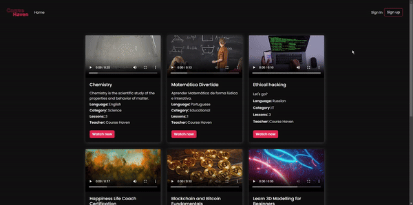
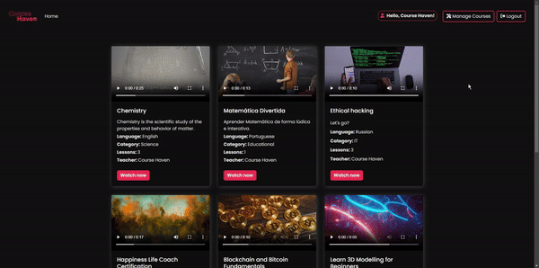
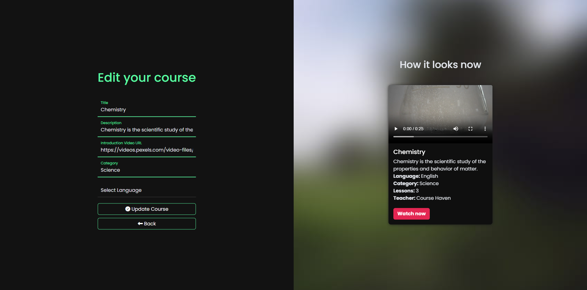
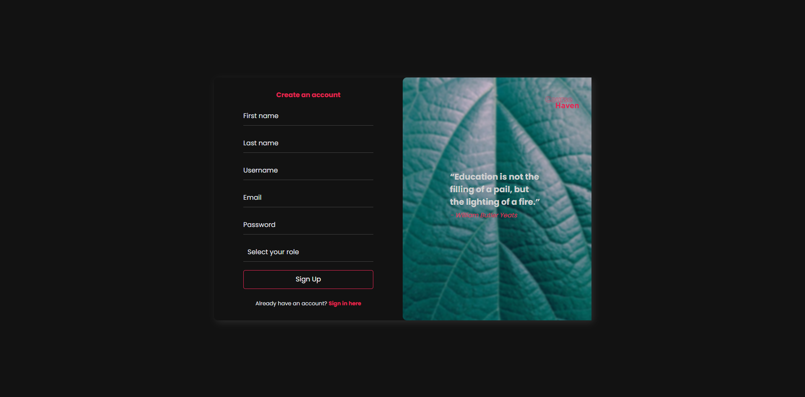

# **CourseHaven** 🎓


**CourseHaven** is a comprehensive online course platform that enables teachers to create, edit, and manage their courses, while students can explore and enroll in courses. It features a dynamic management page accessible only to teachers.

## **Table of Contents** 📚

1. [Features](#features) ✨
2. [Installation](#installation) ⚙️
3. [Usage](#usage) 💻
4. [Screenshots](#screenshots) 🖼️
5. [Technologies Used](#technologies-used) 🛠️
6. [Contributing](#contributing) 🤝
7. [License](#license) 📜
8. [Contact](#contact) 📧

<a name="features"></a>

## **Features** ✨

- **User Registration & Authentication**: Secure registration system with distinct roles for Students and Teachers.
- **Teacher Management Panel**: A dedicated management page accessible only to teachers for course creation and management.
- **Responsive Design**: A modern interface optimized for various screen sizes.
- **Course Enrollment**: Students can browse and enroll in courses.
- **Admin Page**: Secure management page for teachers to manage their content.

<a name="installation"></a>

## **Installation** ⚙️

### **Prerequisites** 🛠️

- Java 11+
- Maven
- MySQL or any other relational database

### **Steps** 🚀

1. Clone the repository:
    ```bash
    git clone https://github.com/luiz-matoso/coursehaven.git
    ```
2. Navigate to the project directory:
    ```bash
    cd coursehaven
    ```
3. Configure your database in `application.properties`:
    ```properties
    spring.datasource.url=jdbc:mysql://localhost:3306/yourdatabase
    spring.datasource.username=yourusername
    spring.datasource.password=yourpassword
    ```
4. Build the project:
    ```bash
    mvn clean install
    ```
5. Run the application:
    ```bash
    mvn spring-boot:run
    ```

<a name="usage"></a>

## **Usage** 💻

1. Access the application via `http://localhost:8080`.
2. Register as a Student or Teacher.
3. Teachers can access the management panel at `/teacher/management` to manage courses.
4. Students can browse and enroll in courses on the home page.

<a name="screenshots"></a>

## **Screenshots** 🖼️

### **Home Page** 🏠



### **Teacher Management Panel** 🎓



### **Edit Course** 📝



### **User Registration** 🔑



<a name="technologies-used"></a>

## **Technologies Used** 🛠️

- **Backend**: Spring Boot, Spring Security, MySQL
- **Frontend**: Thymeleaf, Bootstrap, HTML, CSS
- **Authentication**: Spring Security
- **Database**: Postgres

<a name="contributing"></a>

## **Contributing** 🤝

Contributions are welcome! Please fork this repository and submit a pull request for review.

<a name="license"></a>

## **License** 📜

This project is licensed under the MIT License - see the [LICENSE](LICENSE) file for details.

<a name="contact"></a>

## **Contact** 📧

**Luiz Matoso**  
Email: luizhmatoso1340@gmail.com  
GitHub: [luiz-matoso](https://github.com/luiz-matoso)